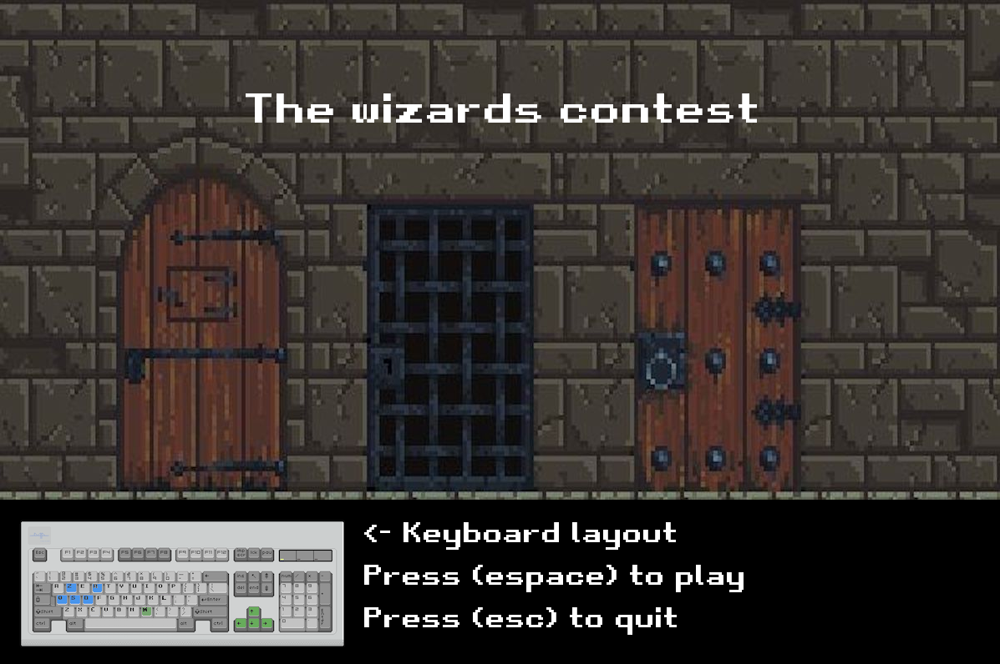

# 👾 Ford-Fulkerson algorithm


<div style="display: flex; justify-content: space-around; align-items: center;">
  
</div>

Python project developped for the INFO2056 course given by Pr. Mathy, ULiège.<br>
The final mark for this project is 18/20.

Note : No copying (even partial) of this code within the scope of the INFO2056 course will be tolerated.

<div style="display: flex; justify-content: space-around; align-items: center;">
  
</div>

## Features

- 1vs1 game on the same keyboard (see main title screen for keybinds).
- Customizable map, see `/classes/decor.py`. The `MAP` matrix can be modified to transform the map. For example, the following matrix gives the map seen above :
```python
MAP = [
        ['┏', '━', '━', '━', '━', '━', '┳', '━', '━', '━', '━', '┳', '━', '━', '━', '━', '┳', '━', '━', '━', '━', '━', '━', '┓'],
        ['┃', ' ', ' ', ' ', ' ', ' ', '┃', ' ', ' ', ' ', ' ', '┃', ' ', ' ', ' ', ' ', '┃', ' ', ' ', ' ', ' ', ' ', ' ', '┃'],
        ['┃', ' ', ' ', ' ', ' ', ' ', '┃', ' ', ' ', '┃', ' ', '┗', ' ', ' ', ' ', ' ', '┃', ' ', ' ', ' ', ' ', ' ', ' ', '┃'],
        ['┃', ' ', ' ', '━', ' ', ' ', '┃', ' ', ' ', '┃', ' ', ' ', ' ', ' ', ' ', ' ', '┃', ' ', ' ', ' ', ' ', ' ', ' ', '┃'],
        ['┃', ' ', ' ', ' ', ' ', ' ', '┃', ' ', ' ', ' ', ' ', '┏', ' ', ' ', ' ', ' ', '┃', ' ', ' ', ' ', ' ', ' ', ' ', '┃'],
        ['┃', ' ', ' ', ' ', ' ', ' ', '┃', ' ', ' ', ' ', ' ', '┃', ' ', ' ', ' ', ' ', '┃', ' ', ' ', ' ', ' ', '↦', '━', '┫'],
        ['┃', ' ', ' ', ' ', ' ', ' ', '┗', '━', '━', '━', '━', '┛', ' ', ' ', ' ', ' ', '↥', ' ', ' ', ' ', ' ', ' ', ' ', '┃'],
        ['┃', ' ', ' ', ' ', ' ', ' ', ' ', ' ', ' ', ' ', ' ', ' ', ' ', ' ', ' ', ' ', ' ', ' ', ' ', ' ', ' ', ' ', ' ', '┃'],
        ['┃', ' ', ' ', ' ', ' ', ' ', ' ', ' ', ' ', ' ', ' ', ' ', ' ', ' ', '━', ' ', ' ', ' ', ' ', ' ', ' ', ' ', ' ', '┃'],
        ['┃', ' ', '↦', '┳', '↤', ' ', ' ', ' ', ' ', ' ', ' ', ' ', ' ', ' ', ' ', ' ', ' ', ' ', ' ', ' ', ' ', ' ', ' ', '┃'],
        ['┃', ' ', ' ', '┃', ' ', ' ', ' ', ' ', '━', ' ', ' ', ' ', ' ', ' ', ' ', '━', '━', '━', '┛', ' ', ' ', ' ', ' ', '┃'],
        ['┃', ' ', ' ', '┃', ' ', ' ', ' ', ' ', ' ', ' ', ' ', ' ', ' ', ' ', ' ', ' ', ' ', ' ', ' ', ' ', ' ', ' ', ' ', '┃'],
        ['┃', ' ', ' ', '↥', ' ', ' ', ' ', ' ', ' ', ' ', ' ', '↧', ' ', ' ', ' ', ' ', ' ', ' ', ' ', ' ', ' ', ' ', ' ', '┃'],
        ['┃', ' ', ' ', ' ', ' ', ' ', ' ', ' ', ' ', ' ', ' ', '┃', ' ', ' ', ' ', ' ', '↦', '━', '┓', ' ', ' ', ' ', ' ', '┃'],
        ['┃', ' ', '━', ' ', ' ', ' ', ' ', ' ', ' ', ' ', ' ', '┃', ' ', ' ', ' ', ' ', ' ', ' ', '┃', ' ', ' ', ' ', ' ', '┃'],
        ['┗', '━', '━', '━', '━', '━', '━', '━', '━', '━', '━', '┻', '━', '━', '━', '━', '━', '━', '┻', '━', '━', '━', '━', '┛']
]
```
 
## Try it!
- Install Python 3 from [here](https://www.python.org/downloads/)
- Install pygame by typing from a terminal :
```console
pip3 install pygame
```
- Run the game by typing from a terminal :
```console
cd projectLocation
cd classes
python3 main.py
```

## Required modules
- pygame

## Credits
- [Simon Gardier](https://github.com/simon-gardier) (Co-author)
- Lei Yang (Co-author)
